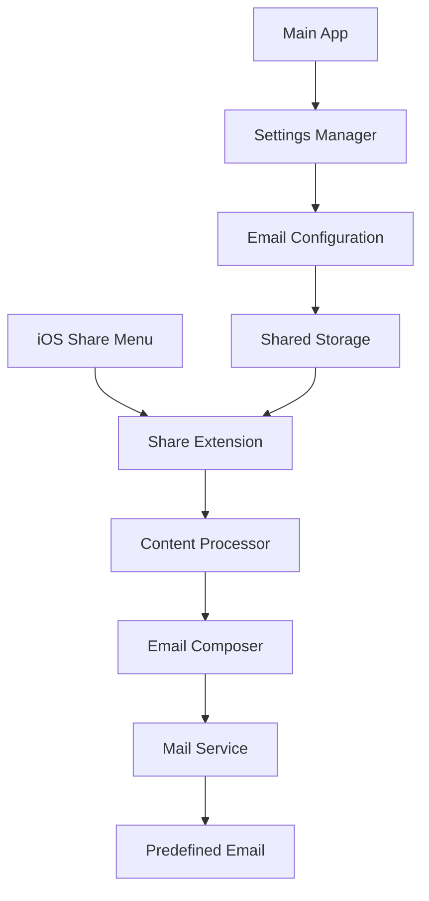

# Design Document

## Overview

The iOS Share Email app consists of two main components: a main app for configuration and a share extension for handling shared content. The app leverages iOS's share extension framework to integrate with the system share menu and uses MessageUI framework for email composition and sending.

## Architecture

### High-Level Architecture



### Component Breakdown

1. **Main App (Laplasian)**: Configuration interface and settings management
2. **Share Extension**: Handles incoming shared content from other apps
3. **Shared Storage**: App Group container for sharing data between main app and extension
4. **Content Processor**: Processes different types of shared content
5. **Email Composer**: Composes and sends emails using MessageUI

## Components and Interfaces

### 1. Main App Components

#### EmailConfigurationView
- **Purpose**: UI for setting up the predefined email address
- **Interface**: SwiftUI view with text field and validation
- **Responsibilities**:
  - Email address input and validation
  - Save configuration to shared storage
  - Display current configuration status

#### SettingsManager
- **Purpose**: Manages app settings and shared storage
- **Interface**: ObservableObject class
- **Methods**:
  - `saveEmailAddress(_:)`: Stores email in App Group container
  - `getEmailAddress()`: Retrieves stored email address
  - `isConfigured()`: Checks if email is configured

### 2. Share Extension Components

#### ShareViewController
- **Purpose**: Main controller for the share extension
- **Interface**: Inherits from UIViewController
- **Responsibilities**:
  - Receive shared content from iOS
  - Process different content types
  - Coordinate email composition and sending

#### ContentProcessor
- **Purpose**: Processes different types of shared content
- **Interface**: Struct with static methods
- **Methods**:
  - `processText(_:)`: Handles plain text content
  - `processImage(_:)`: Handles image attachments
  - `processURL(_:)`: Handles URL content with metadata
  - `processFile(_:)`: Handles file attachments

#### EmailComposer
- **Purpose**: Composes and sends emails
- **Interface**: Class conforming to MFMailComposeViewControllerDelegate
- **Methods**:
  - `composeEmail(content:attachments:)`: Creates email with content
  - `sendEmail()`: Sends the composed email
  - `handleSendResult(_:)`: Processes send results

### 3. Shared Components

#### SharedStorage
- **Purpose**: Manages data sharing between main app and extension
- **Interface**: Singleton class
- **Methods**:
  - `getSharedContainer()`: Returns App Group container URL
  - `saveConfiguration(_:)`: Saves settings to shared storage
  - `loadConfiguration()`: Loads settings from shared storage

## Data Models

### EmailConfiguration
```swift
struct EmailConfiguration: Codable {
    let recipientEmail: String
    let isConfigured: Bool
    let lastUpdated: Date
}
```

### SharedContent
```swift
struct SharedContent {
    let type: ContentType
    let data: Data
    let metadata: [String: Any]?
}

enum ContentType {
    case text(String)
    case image(UIImage)
    case url(URL)
    case file(URL)
}
```

### EmailContent
```swift
struct EmailContent {
    let subject: String
    let body: String
    let attachments: [EmailAttachment]
}

struct EmailAttachment {
    let data: Data
    let mimeType: String
    let fileName: String
}
```

## Error Handling

### Error Types
```swift
enum ShareEmailError: LocalizedError {
    case noEmailConfigured
    case invalidEmailAddress
    case contentProcessingFailed
    case emailCompositionFailed
    case sendingFailed(Error)
    case networkUnavailable
    
    var errorDescription: String? {
        switch self {
        case .noEmailConfigured:
            return "No email address configured. Please open the main app to set up."
        case .invalidEmailAddress:
            return "Invalid email address configured."
        case .contentProcessingFailed:
            return "Failed to process shared content."
        case .emailCompositionFailed:
            return "Failed to compose email."
        case .sendingFailed(let error):
            return "Failed to send email: \(error.localizedDescription)"
        case .networkUnavailable:
            return "Network unavailable. Please check your connection."
        }
    }
}
```

### Error Handling Strategy
1. **Configuration Errors**: Redirect user to main app for setup
2. **Content Processing Errors**: Show error with retry option
3. **Network Errors**: Queue for retry when network is available
4. **Sending Errors**: Display error message with manual retry option

## Testing Strategy

### Unit Tests
1. **ContentProcessor Tests**:
   - Test processing of different content types
   - Test error handling for invalid content
   - Test metadata extraction

2. **EmailComposer Tests**:
   - Test email composition with various content types
   - Test attachment handling
   - Test error scenarios

3. **SettingsManager Tests**:
   - Test configuration save/load operations
   - Test validation logic
   - Test shared storage operations

### Integration Tests
1. **Share Extension Flow**:
   - Test end-to-end sharing from different apps
   - Test email sending with various content types
   - Test error handling and user feedback

2. **Main App Integration**:
   - Test configuration flow
   - Test data sharing between app and extension
   - Test settings persistence

### UI Tests
1. **Main App UI**:
   - Test email configuration interface
   - Test settings validation and feedback
   - Test navigation and user flows

2. **Share Extension UI**:
   - Test loading states and progress indicators
   - Test success and error message display
   - Test cancellation handling

## Implementation Considerations

### iOS Share Extension Requirements
- Share extension must be lightweight and fast
- Limited memory and processing time
- Must handle extension lifecycle properly
- Should provide immediate user feedback

### Email Sending Approach
- Use MessageUI framework for native email composition
- Handle cases where Mail app is not configured
- Implement fallback mechanisms for sending failures
- Consider background sending for better user experience

### Data Sharing
- Use App Groups for sharing data between main app and extension
- Implement proper data synchronization
- Handle concurrent access to shared storage
- Ensure data privacy and security

### Performance Optimization
- Lazy loading of heavy resources
- Efficient image processing and compression
- Background processing where possible
- Memory management for large attachments